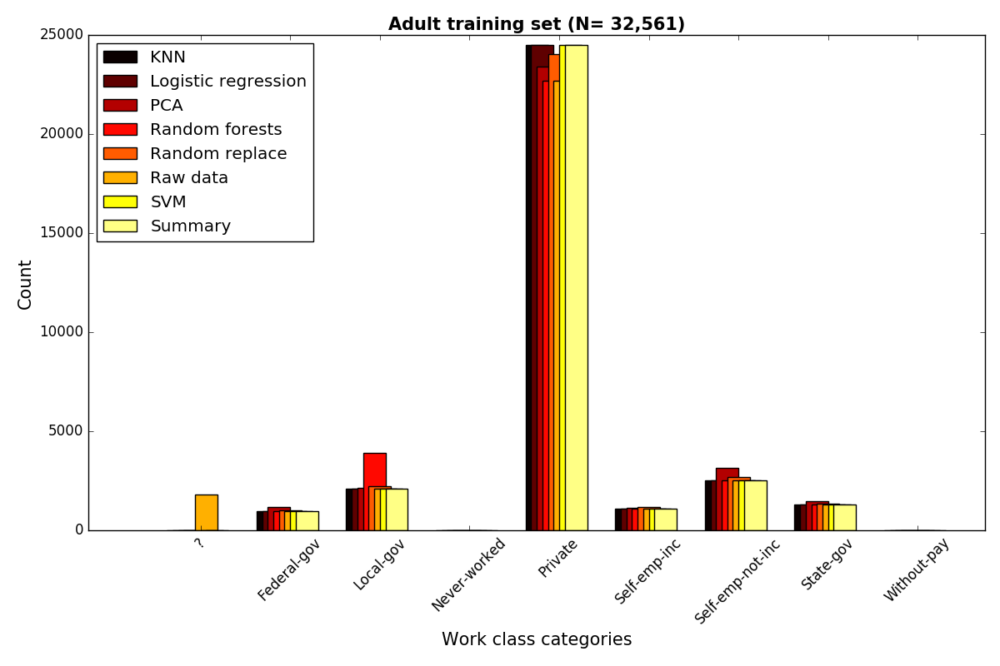
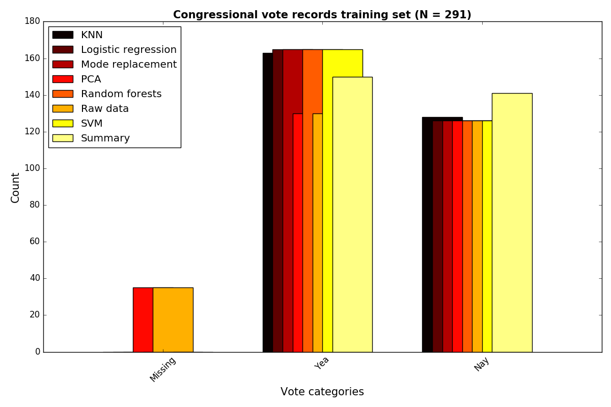

# MDI

This repository is associated with the paper ["Missing Data Imputation for Supervised Learning"](https://doi.org/10.1080/08839514.2018.1448143) [(arXiv)](https://arxiv.org/abs/1610.09075), which empirically evaluates methods for imputing missing categorical data for supervised learning tasks.

Please cite the paper if you use this code for academic research:

```
@article{poulos2018missing,
  title={Missing data imputation for supervised learning},
  author={Poulos, Jason and Valle, Rafael},
  journal={Applied Artificial Intelligence},
  volume={32},
  number={2},
  pages={186--196},
  year={2018},
  publisher={Taylor \& Francis}
}
```
## Prerequisites

**Python 2**

## Techniques for handling categorical missing data
We categorize proposed imputation methods into six groups listed below:

**Case substitution**
One observation with missing data is replaced with another non-sampled obser- vation.

**Summary statistic**
Replace the missing data with the mean, median, or mode of the feature vec- tor. Using a numerical approach directly is not appropriate for nonordinal categorical data.

**One-hot**
Create a binary variable to indicate whether or not a specific feature is missing.

**Hot deck and cold deck**
Compute the K-Nearest Neighbors of the observation with missing data and assign the mode of the K-neighbors to the missing data. algorithm.

**Prediction Model**
Train a prediction model (e.g., random forests) to predict the missing value.

**Factor analysis**
Perform factor analysis (e.g., principal component analysis (PCA)) on the design matrix, project the design matrix onto the first N eigenvectors and replace the missing values by the values that might be given by the projected design matrix.

## Adult Dataset example ##
The figure below shows frequency of job category in the Adult dataset before
and after the imputation techniques above were used. Code can be found [here](example_adult.py)



## Congresssional voting records dataset example ##
Code can be found [here](example_votes.py)

